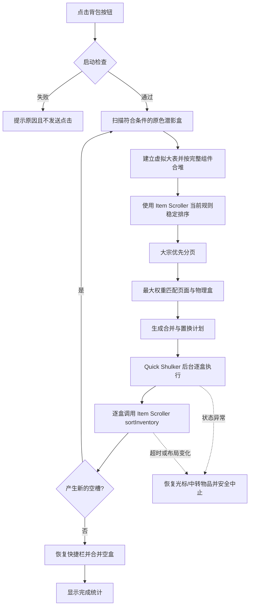

# Shulker Box Sort

适用于 Minecraft Java 版 26.1.x 的 Fabric 客户端模组。它把玩家背包中的普通原色潜影盒视为一张虚拟大表，合并相同物品、按照 Item Scroller 的当前规则全局排序，再通过 Quick Shulker 的服务端同步容器逐盒完成搬运。

项目采用 [MIT License](LICENSE)。允许 Fork、修改、二次开发和重新发布，但必须保留原许可证及版权声明。

## 下载

当前版本：**2.1.4**

- [下载已构建的 2.1.4 JAR](releases/shulkerbox_sort-fabric-26.1.2-2.1.4.jar)
- [查看版本记录](VERSION_HISTORY.md)
- JAR SHA-256：`CCB6A7270DA1631B49421CF4912F99477D157D8B48DB4F1B3583C2523685FF3A`

下载后将 JAR 与所需前置一起放入客户端的 `mods` 目录。服务端是否需要 Quick Shulker 取决于 Quick Shulker 自身及服务器配置。

## 版本与前置要求

| 项目 | 要求 | 说明 |
| --- | --- | --- |
| Minecraft | `>=26.1 <26.2` | 使用 26.1.2 开发和构建 |
| Java | 25 或更高 | 构建目标为 Java 25 |
| Fabric Loader | `>=0.18.4` | 已尽量放宽声明限制 |
| Fabric API | 与 Minecraft 26.1.x 匹配 | 构建使用 `0.152.1+26.1.2` |
| Item Scroller | 建议 `>=0.31.0` | 功能前置；读取用户排序规则并执行最终盒内整理 |
| Quick Shulker | 建议 `>=3.0.1` | 功能前置；后台打开真实服务端容器 |
| MaLiLib | 由 Item Scroller 决定 | 本模组不直接依赖 MaLiLib |

本模组不会把 Item Scroller、Quick Shulker、MaLiLib 或 Fabric API 打包进成品 JAR。

## 使用方法

1. 打开原版玩家背包。
2. 点击配方书按钮右侧的 14×14 小按钮。
3. 等待提示完成。整理期间不要移动背包物品。

运行期间玩家背包界面会被禁用并显示提示，避免替换后台同步容器；移动和切换视角仍然可用。

首版范围限制：

- 只整理未染色、未命名、无特殊用途组件、数量为 1 的普通原版潜影盒。
- 彩色盒、命名盒、特殊盒和堆叠的非空盒会被跳过。
- 单一物品且容量完全满的盒子会锁定，不参与重排。
- 启动时必须在36个主背包/快捷栏槽中至少留有一个空槽。
- 默认假设服务器配置允许空潜影盒堆叠；最后只合并实际规则允许堆叠且组件相同的空盒。

## 关键问题与实现思路

### 1. 多个潜影盒不是一个真实容器

Item Scroller 的 R 键只能整理当前真实打开的一个容器，不能直接处理多个关闭的潜影盒。本模组先读取所有符合条件的盒内内容，建立纯逻辑虚拟大表；Item Scroller 提供排序规则，跨盒搬运仍由本模组的状态机执行。

### 2. 物品相同不只取决于物品 ID

合并键由“物品 ID + 完整数据组件”组成。附魔、耐久、名称、容器内容等组件不同的物品严格分离；不可堆叠物品也不会错误合并。

### 3. 排序后不能按背包顺序绑定盒子

目标页面通过最大权重二分匹配分配给物理潜影盒：优先保留盒内已有的相同物品数量，其次保留同槽同数量堆，再确定性打破平局。这样靠后盒子持有大量排序前段物品时，可以直接承接前段页面，减少跨盒搬运。

### 4. 大宗物品与分页边界

六组及以上的物品优先分页。完整27组先形成同类满盒，余量再与其他内容组合；单一物品且完全满的盒子直接锁定。只有“不拆分就必须额外增加非空盒”时，较小的大宗组才会跨页。

### 5. 不满组不能逐格向后冒泡

物品超过一盒且靠前存在不满组时，从尾部来源直接补满，不让不满组沿27格逐次后移。物品不超过一盒且合并不能减少占用格数时，保持首次出现顺序，不为把不满组移动到末格而做无效搬运。

### 6. 真实服务端容器与物品安全

Quick Shulker 打开真实同步菜单，画面被隐藏但容器和点击均是真实的。每次操作都通过原版容器点击入口发送，并校验容器 ID、state ID、槽位内容、数量、完整组件和光标状态。跨盒置换使用空快捷栏槽作为寄存器；快捷栏没有空槽时，会借用唯一空背包槽并在完成后恢复原物品。

### 7. Item Scroller 收尾需要达到固定点

全局填充完成后，每个非空原色潜影盒都会再次调用 Item Scroller 的真实 `sortInventory`。如果盒内合堆产生新空槽，模组会重新建立全局大表、补充空位并再执行一轮。只有完整一轮没有产生新空槽时才结束。

## 处理流程



## 安全边界

- 光标有物品、背包没有空槽或已有任务运行时拒绝启动。
- 断线、死亡、意外界面、同步超时、服务端拒绝或槽位内容变化时停止自动操作。
- 中止前优先放回光标与中转物品；无法确认安全恢复时保留当前容器供玩家手动处理。
- 不直接伪造潜影盒组件或客户端容器状态，不主动丢弃物品。

尽管项目包含规划器单元测试和构建验证，涉及服务端协议、延迟及其他模组交互的场景仍建议先在可恢复环境中测试。

## 从源码构建

需要 Java 25：

```powershell
.\gradlew.bat clean build
```

Linux/macOS：

```bash
./gradlew clean build
```

成品位于 `build/libs/`。规划器测试覆盖组件隔离、合堆守恒、稳定排序、大宗分页、乱序匹配、置换环和不满组直供等场景。

## 上游交互与版权

- Quick Shulker 打开流程依据其公开 `ClientUtil.CheckAndSend` 接口独立实现。
- Item Scroller 作为外部依赖，兼容层调用其比较器和公开容器整理入口。
- 项目参考交互协议和公开 API，不复制 `litematica-printer` 的 AGPL 源码。
- 第三方项目各自遵循其许可证，本仓库不重新分发这些前置模组。

## 贡献

欢迎提交 Issue、Fork 和 Pull Request。请先阅读 [CONTRIBUTING.md](CONTRIBUTING.md)，并确保修改后能够通过 `clean build`。
